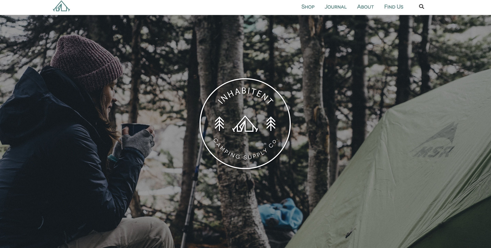

# Project 4 - Inhabitent

Inhabitent is a hipster camping website built on WordPress where I had to make a custome theme to meet a desired look. Much of the time used on this project involved planning the CSS to be as effiecient as posssible. 

#Built Using

-Wordpress
-HTML
-PHP
-CSS
-JavaScript
-jQuery
-SASS
-GULP

#Outcome

Not including the initial WordPress setup, I was given roughly a week to style and add functionality to Inhabitant. It was for sure a tight time frame, but manageable. The main takeaway I got from this project is to always take time to layout how I am going to approach styling every page. I made the mistake of jumping right into the project, and realized that I could of been much more efficient with my code if I spent time organizing my thoughts first. Once I realized I was repeating a lot of the same code, I decided to take a few steps back and restart some of the progress I already made so that I could save some time in the future. 

After this project, I now know one of the most important things in web development is to take the time early to plan my layout, so I can save an immense amount of time for the future.
